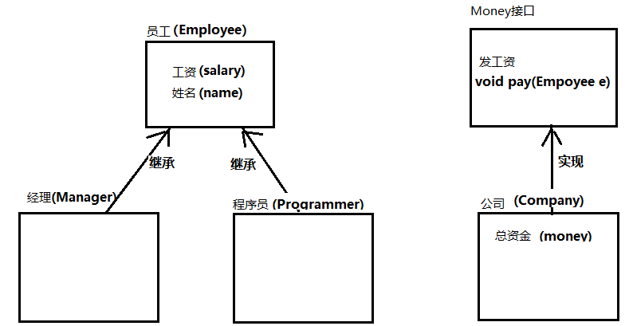

```java
作业规范【必读】

命名要求：
	1. 类名，接口名，枚举名，注解名使用大驼峰
	2. 变量名，方法名，包名均使用小驼峰
	3. 常量名全大写，多个单词下划线分割
	4. 名字要见名知意，如果不知道对应的英文，可以使用拼音代替。不可使用无意义字符
  
  【以上命名要求，检查作业发现没有遵守，发现一处，做俯卧撑5个。】
	
代码规范：
	格式要良好，使用IDEA格式化缩进（快捷键：Ctrl+Alt+L）
	
  
答题规范：
	1. 每道题完整代码请贴入对应题目中的代码区。
  2. 如果有运行结果的，请把代码运行结果放到文档中
  

作业提交：
  1. 将当前文件所在文件夹压缩后，以自己的名字命名提交给组长。组长在每天的上课前收集并发送给老师
  2. 未交作业的同学，男50个俯卧撑，女20个俯卧撑，不接受任何理由，比如事假缺勤等。
  3. 敷衍作业（包括但不限于直接用别人的作业提交，直接拷贝别人的代码的情况）的同学，男50个俯卧撑，女20个俯卧撑。
  
```


# 【关键字】

## 题目1

定义一个数学工具类，类名使用MyMath。

要求：

1. 该工具类不能有子类，不接受扩展。
2. 该工具类不能被外界创建对象，构造方法需要私有化。
3. 定义静态常量：PI，用来保存圆周率：3.14。
4. 定义静态方法max，获取两个整数的较大值。
5. 定义静态方法min，获取两个整数的较小值。


答案：

```java
final class MyMath {
    private MyMath() {

    }

    public static final double PI = 3.14;

    public static int max(int a, int b) {
        int max;
        return max = a >= b ? a : b;
    }

    public static int min(int a, int b) {
        int min;
        return min = a >= b ? b : a;
    }
}


```


# 【接口】

## 题目2

1. 请定义“员工(类)”：
   属性：姓名、性别、年龄(全部私有)
   行为：工作(抽象)
   无参、全参构造方法
   get/set方法

2. 请定义“绘画(接口)”
   抽象方法：绘画
3. 请定义“Java讲师类”继承自“员工类”
4. 请定义”UI讲师类”，继承自“员工类”，并实现“绘画”接口。

**要求**：

1. 请按上述要求设计出类结构，并实现相关的方法。
2. 测试类中创建对象测试，属性可自定义：
   - 创建一个Java讲师类对象，调用工作的方法。
   - 创建一个UI讲师类对象，调用工作方法，和绘画方法。

**答案：**

```java
abstract class Person{
    private String name;
    private String seg;
    private String age;

    abstract public void active();

    public String getName() {
        return name;
    }

    public void setName(String name) {
        this.name = name;
    }

    public String getSeg() {
        return seg;
    }

    public void setSeg(String seg) {
        this.seg = seg;
    }

    public String getAge() {
        return age;
    }

    public void setAge(String age) {
        this.age = age;
    }

    public Person(String name, String seg, String age) {
        this.name = name;
        this.seg = seg;
        this.age = age;
    }

    public Person() {
    }
}

class JavaTeacher extends Person{

    @Override
    public void active() {
        System.out.println("上Java课");
    }

    public JavaTeacher(String name, String seg, String age) {
        super(name, seg, age);
    }

    public JavaTeacher() {
    }

    @Override
    public String toString() {
        return "JavaTeacher{" + "name=" + "'" + super.getName() + "'" + ",gender=" + "'" + super.getSeg() + "'" + ",age=" + "'" + super.getAge() + "'" + "}";
    }
}

class UITeacher extends Person implements Print{
    public UITeacher(String name, String seg, String age) {
        super(name, seg, age);
    }

    public UITeacher() {
    }

    @Override
    public void active() {
        System.out.println("将UI课程");
    }

    @Override
    public void print() {
        System.out.println("绘画");
    }

    @Override
    public String toString() {
        return "JavaTeacher{" + "name=" + "'" + super.getName() + "'" + ",gender=" + "'" + super.getSeg() + "'" + ",age=" + "'" + super.getAge() + "'" + "}";
    }
}

public class Demo {
    public static void main(String[] args) {
        JavaTeacher javaTeacher = new JavaTeacher("peter","boy","20");

        System.out.println(javaTeacher);
        javaTeacher.active();
        UITeacher uiTeacher = new UITeacher("jake","girl","22");

        System.out.println(uiTeacher);
        uiTeacher.active();
        uiTeacher.print();


    }
}


public interface Print {
    public void print();
}
```


**运行结果：**

```java
JavaTeacher{name='peter',gender='boy',age='20'}
上Java课
JavaTeacher{name='jake',gender='girl',age='22'}
将UI课程
绘画
```


## 题目3

1. 编写一个接口ShapePara，要求： 接口中的方法：

   ```
    int getArea()：获得图形的面积。
    int getCircumference()：获得图形的周长
   ```

2. 编写一个圆类Circle，要求：圆类Circle实现接口ShapePara。

   **该类含有一个静态常量：**

   ```
   PI： double类型，值为3.14
   ```

   **该类包含有成员变量：**

   ```java
   radius:	public修饰的double类型radius,表示圆的半径。
   x:	private修饰的double型变量x，表示圆心的横坐标。
   y:	protected修饰的double型变量y，表示圆心的纵坐标。
   ```

   **包含的方法有：**

   ```java
   Circle(double radius) 有参构造方法。以形参表中的参数初始化半径，圆心为坐标原点（x=0,y=0）。 
     
   double getRadius()：获取半径为方法的返回值。
     
   void setCenter(double x, double  y)：利用形参表中的参数设置类Circle的圆心坐标。
     
   void setRadius(double  radius)：利用形参表中的参数设置类Circle的radius域。
   ```


请根据上述要求代码实现相关类和接口，并定创建测试类，定义一个圆对象。半径为10，求周长和面积。

```
注：
圆周长公式： 周长 = PI*2*radius
圆面积公式： 面积 = PI * radius*radius
```

**代码：**

```java
public interface ShapePara {
    public final static double PI = 3.14;

    public abstract int getArea();
    public abstract int getCircumference();
}

public class Circle implements ShapePara{
    double radius;
    private double x;
    private double y;

    public Circle(double radius) {
        this.radius = radius;
        this.x = 0;
        this.y = 0;
    }

    public double getRadius() {
        return this.radius;
    }

    public void setCenter(double x, double y) {
        this.x = x;
        this.y = y;
    }

    public void setRadius(double radius) {
        this.radius = radius;
    }

    @Override
    public int getArea() {
        return 0;
    }

    @Override
    public int getCircumference() {
        return 0;
    }

    public static void main(String[] args) {
        Circle ci = new Circle(10);

        System.out.println("周长为：" + Circle.PI * 2 * ci.radius);
        System.out.println("面积为： " + Circle.PI * ci.radius * ci.radius);
    }
}

```

​		


## 题目4

创建接口Charge，其中有一个抽象方法charge()， 
创建接口Play，其中有一个抽象方法play()，
创建类Bus来实现接口Charge，对于Bus中的charge()，实现为输出“公共汽车：1元/张，不计公里数”。 
创建类Taxi来实现接口Charge，对于Taxi中的charge()，实现为输出“出租车：1.6元/公里，起价3公里。” 

声明类Cinema来同时实现接口Charge，Play。对于Cinema中的charge()，实现为输出`解放电影院：“30元/张，凭学生证享受半价。”` 对于Cinema中的play()。实现输出为`“正在放映电影。` 

在测试类中创建Bus，Taxi，Cinema的对象，调用方法输出结果。


**代码：**

```java
public interface Play {
    public abstract void play();
}

public interface Charge {
    public abstract void charge();
}

public class Taxi implements Charge{
    @Override
    public void charge() {
        System.out.println("出租车：1.6元/公里，起价3公里。");
    }
}


public class Bus implements Charge{
    @Override
    public void charge() {
        System.out.println("公共汽车：1元/张，不计公里数");
    }
}

public class Cinema implements Charge, Play{
    @Override
    public void charge() {
        System.out.println("30元/张，凭学生证享受半价。");
    }

    @Override
    public void play() {
        System.out.println("正在放映电影。");
    }
}

public class Test {
    public static void main(String[] args) {
        Bus bu = new Bus();
        bu.charge();
    }

}


```

# 【多态】

## 题目1

有以下类定义：

动物类

```
属性：名称、年龄、性别
行为：吃
```

猫类继承动物

```java
行为：
  吃（重写）
  捉老鼠
```

狗类继承动物

```java
行为：
  吃（重写）
  看家
```


**要求**

请按要求定义上述类，并用多态的格式测试调用“吃饭”和“捉老鼠”的方法，看看有什么特点？

```java
abstract class Animal{
    private String name;
    private int age;
    private String sex;


    public abstract void eat();

}

class Cat extends Animal{

    @Override
    public void eat() {
        System.out.println("猫吃老鼠");
    }
    public  void action(){
        System.out.println("捉老鼠");
    }
}

class Dog extends Animal{

    @Override
    public void eat() {
        System.out.println("狗吃肉");
    }
    public void action(){
        System.out.println("看家");
    }
}
public class Test01 {
    public static void main(String[] args) {
        Animal cat = new Cat();
        Animal dog = new Dog();
        Cat c = new Cat();
        Dog d = new Dog();
        cat.eat();
        c.action();
        dog.eat();
        d.action();
    }
}
```


## 题目2

**知识点涉及：**

1、继承，接口，多态


**需求：**

模拟公司给员工发工资，代码实现，执行效果如图所示：

 


参考下面的继承结构图完成相关代码的设计：

1、程序员和经理都属于员工，使用继承完成相关类的设计

2、员工作为父类，为其提供带参的构造函数，子类的有参构造需调用父类的有参构造

3、创建接口Money，定义发工资功能，为员工发工资。

4、公司类中定义总资金属性，实现Money接口，通过总资金扣除员工的工资，得出发工资后工资剩余的总资金

5、创建测试类，在main方法中创建经理对象，程序员对象，及公司对象。调用方法给经理和程序员发工资。




**答案：**

```java
import static day11_homework.Test02.money;

class Employee{
    private double salary;
    private String name;

    @Override
    public String toString() {
        return "Employee{" +
                "salary=" + salary +
                ", name='" + name + '\'' +
                '}';
    }

    public Employee(double salary, String name) {
        this.salary = salary;
        this.name = name;
    }

    public Employee() {
    }

    public double getSalary() {
        return salary;
    }

    public void setSalary(double salary) {
        this.salary = salary;
    }

    public String getName() {
        return name;
    }

    public void setName(String name) {
        this.name = name;
    }
}


interface Money{
    public abstract void pay(Employee e);
}

class Manager extends Employee{
    public Manager(double salary, String name) {
        super(salary, name);
    }

    public Manager() {
    }
}

class Programmer extends Employee{
    public Programmer(double salary, String name) {
        super(salary, name);
    }

    public Programmer() {
    }
}

 class  Company implements Money{


    @Override
    public  void pay(Employee e) {
        System.out.println("给"+e.getName()+"发工资 "+e.getSalary()+"元，公司剩余：" +(money - e.getSalary())+"元");
        money = money - e.getSalary();
    }

}

public class Test02 {
    static double money = 1000000.0;
    public static void main(String[] args) {
        Employee e = new Manager(9000.0,"张小强");
        Employee e1 = new Programmer(5000.0,"李小亮");
        Company company = new Company();
        company.pay(e);
        company.pay(e1);
    }


}
```

# 【内部类】

## 题目3

分析下面“成员内部类”程序的运行结果：

```java
public class Demo{
    public static void main(String[] args){
        Outer.Inner obj = new Outer().new Inner();
        obj.show();
    }
}
class Outer{
    public int number = 10;
    class Inner{
        public int number = 20;
        public void show(){
            int number =30;
            System.out.println(number);
            System.out.println(this.number);
            System.out.println(Outer.this.number);
        }
    }
}
```


答案：

```java

```

# 【Lambda】

## 题目1

请使用Lambda表达式启动一个Thread线程，线程中打印：1--100所有数字。

答案：

```java

```

 

## 题目2

请使用Lambda表达式调用Collections的sort()方法，可以实现对一个List<String>集合进行：降序排序。

编写main()方法，在main()中按以下步骤编写代码：

 1. 定义一个List<String>集合，并存储以下数据：

    ```
    "cab","bac","acb","cba",“bca”,"abc"
    ```

2. 使用Lambda表达式调用Collections的sort()方法对集合进行降序排序。

3. 排序后向控制台打印集合的所有元素。

答案：

```java

```


## 题目3

给定一个计算器 Calculator 接口，内含抽象方法 calc(减法)，其功能是可以将两个数字进行相减，并返回差值。

```java
public interface Calculator { 
	int calc(int a, int b); 
}
```

在下面的代码中，请分别使用Lambda的标准格式及省略格式调用 invokeCalc 方法，完成130和120的相减计算： 

```java
public class TestInvokeCalc {
    public static void main(String[] args) {
			//TODO 请分别使用Lambda【标准格式】及【省略格式】调用
 		 	//invokeCalc方法来计算130‐120的结果
    }
    private static void invokeCalc(int a, int b, Calculator calculator) {
        int result = calculator.calc(a, b);
        System.out.println("结果是：" + result);
    }
}
```

----------

答案：

```java

```


